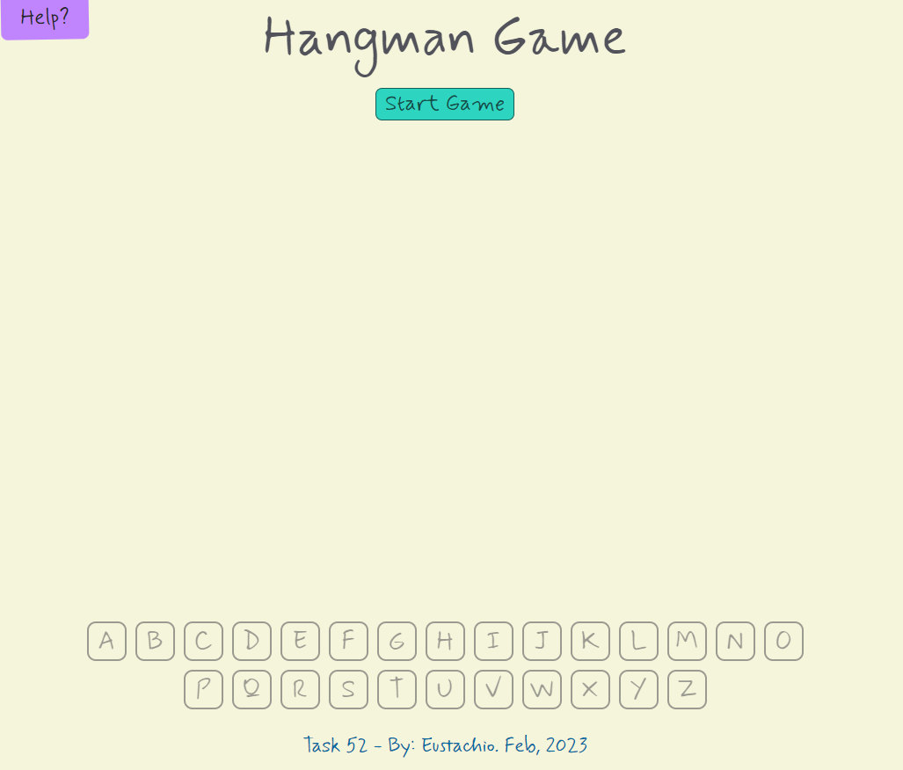
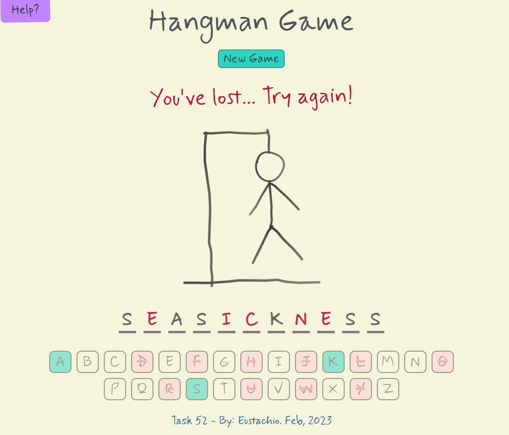
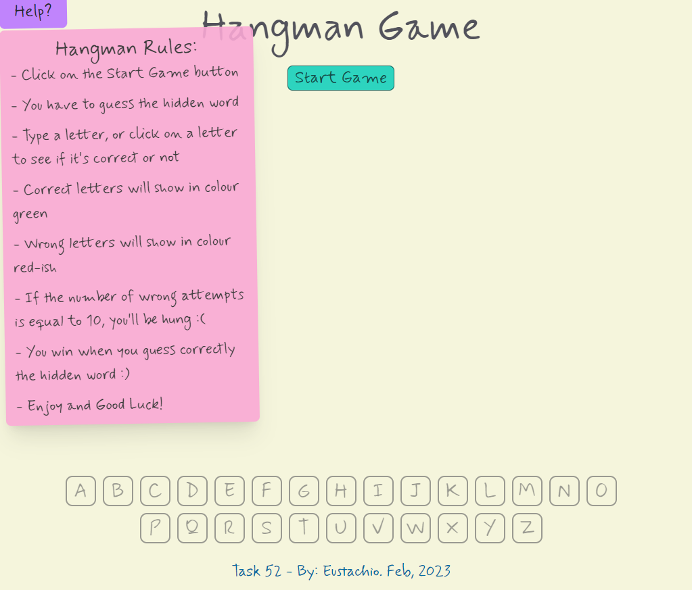
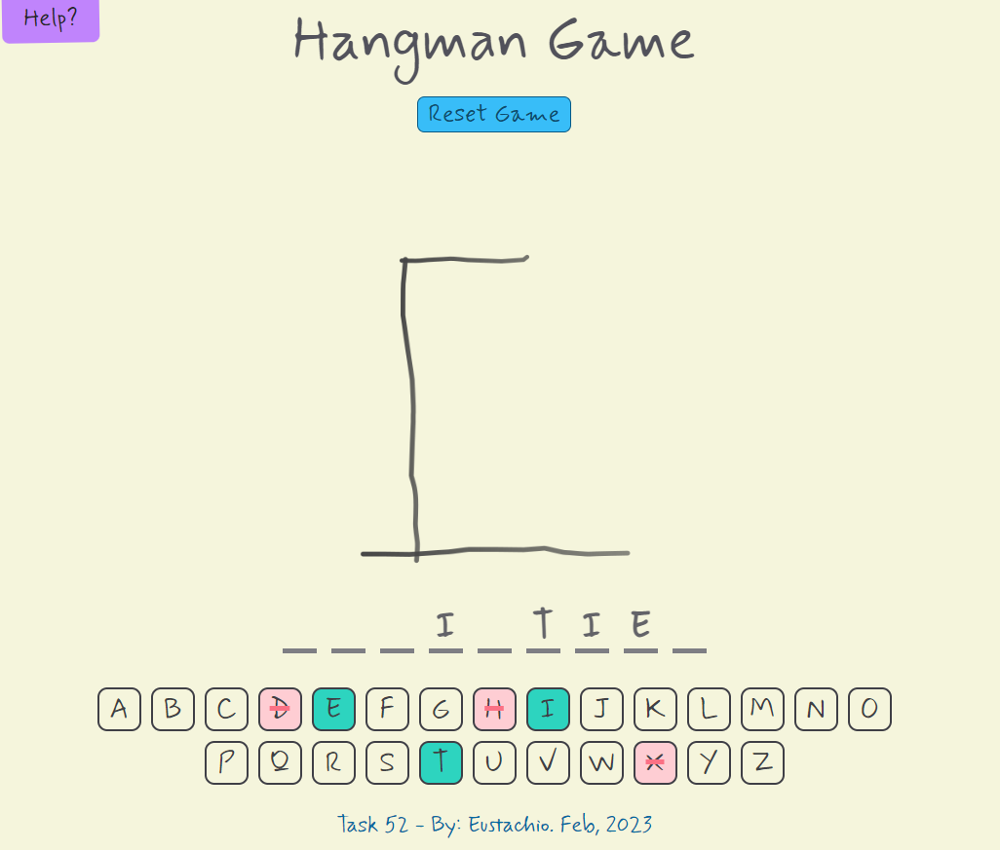
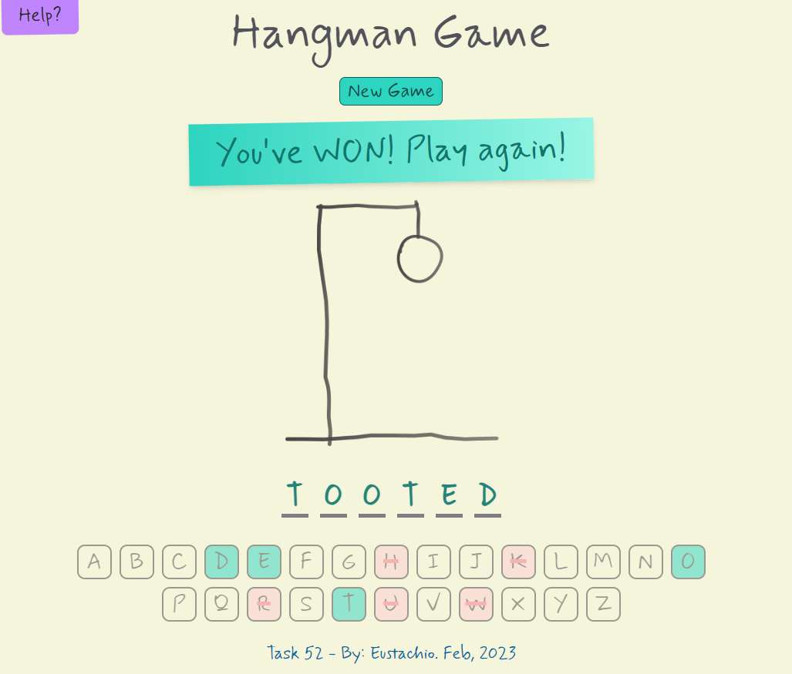

Table of Contents
- [Hangman Game by: Eustachio](#hangman-game-by-eustachio)
- [Here some rules to play the game:](#here-some-rules-to-play-the-game)
- [Screenshots](#screenshots)
  - [Getting Started with Create React App](#getting-started-with-create-react-app)
  - [Available Scripts](#available-scripts)
    - [`npm start`](#npm-start)
    - [`npm test`](#npm-test)
    - [`npm run build`](#npm-run-build)
    - [`npm run eject`](#npm-run-eject)
  - [Credits](#credits)

----
# Hangman Game by: Eustachio
This project corresponds to the final task of the Web Development Bootcamp at HyperionDev.

I remember I used to play this game with my school friends on a piece of paper, this is why I choose to design the app as if it's on a piece of paper and handwriting text style. I hope you like it!

You can either type the keys on your keyboard or click on any key on the keybord of the game.

Words come randomly from an public API, you can find out more here http://random-word-api.herokuapp.com/home

# Here some rules to play the game:
- Click on the Start Game button"
- You have to guess the hidden word"
- Type a letter, or click on a letter to see if it's correct or not"
- Correct letters will show in colour green"
- Wrong letters will show in colour red-ish"
- If the number of wrong attempts is equal to 10, you'll be hung :(
- You win when you guess correctly the hidden word :)
- Enjoy and Good Luck!

# Screenshots

To install the Hangman App, please follow the instructions below:

## Getting Started with Create React App

This project was bootstrapped with [Create React App](https://github.com/facebook/create-react-app), and TailwindCSS for the styling.

## Available Scripts

In the project directory, you can run:

### `npm start`

Runs the app in the development mode.\
Open [http://localhost:3000](http://localhost:3000) to view it in your browser.

The page will reload when you make changes.\
You may also see any lint errors in the console.

### `npm test`

Launches the test runner in the interactive watch mode.\
See the section about [running tests](https://facebook.github.io/create-react-app/docs/running-tests) for more information.

### `npm run build`

Builds the app for production to the `build` folder.\
It correctly bundles React in production mode and optimizes the build for the best performance.

The build is minified and the filenames include the hashes.\
Your app is ready to be deployed!

See the section about [deployment](https://facebook.github.io/create-react-app/docs/deployment) for more information.

### `npm run eject`

**Note: this is a one-way operation. Once you `eject`, you can't go back!**

If you aren't satisfied with the build tool and configuration choices, you can `eject` at any time. This command will remove the single build dependency from your project.

Instead, it will copy all the configuration files and the transitive dependencies (webpack, Babel, ESLint, etc) right into your project so you have full control over them. All of the commands except `eject` will still work, but they will point to the copied scripts so you can tweak them. At this point you're on your own.

You don't have to ever use `eject`. The curated feature set is suitable for small and middle deployments, and you shouldn't feel obligated to use this feature. However we understand that this tool wouldn't be useful if you couldn't customize it when you are ready for it.

## Credits
 - Eustachio is the main creator of this project. Find more projects by him here [github.com/eustachi0](https://github.com/eustachi0)
